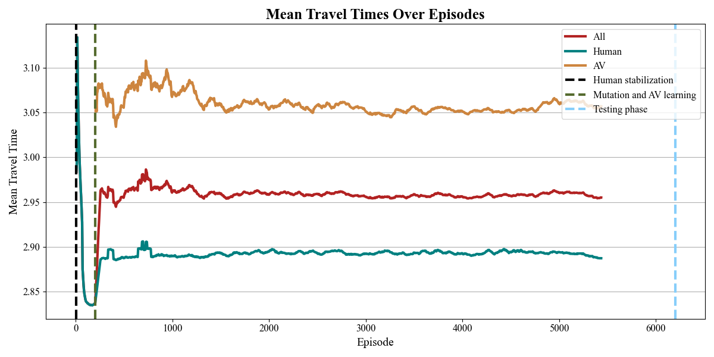
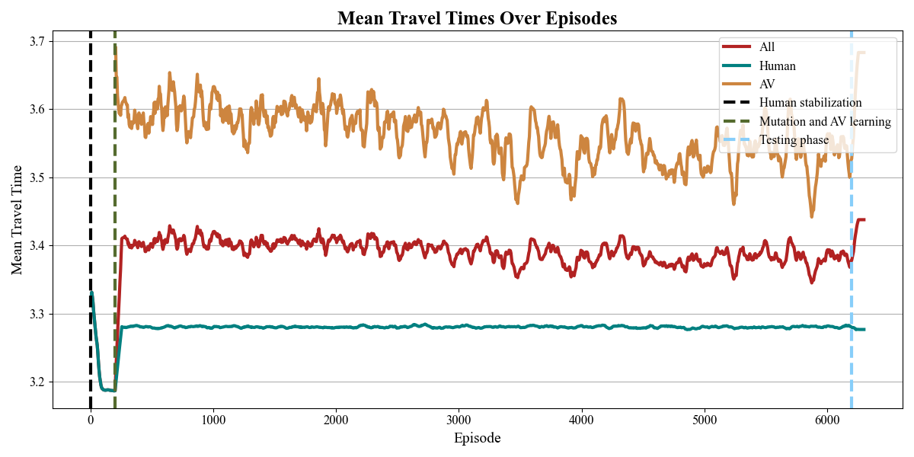
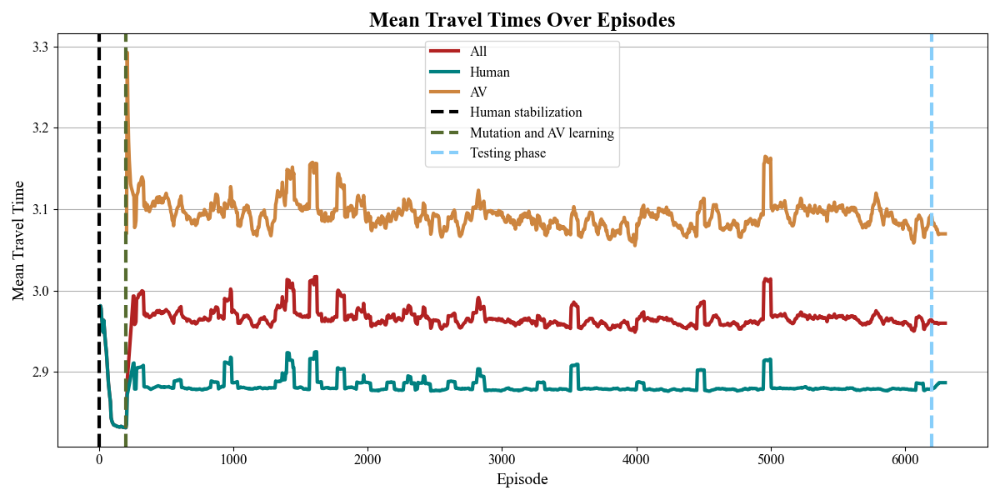

- Task distribution table: [here](https://docs.google.com/spreadsheets/d/1Upf4nPxh5kPqe4qOKV84EOifHWEVYadJx688urlQxb0/edit?gid=0#gid=0).

<!--
---

| Alg x Net | Seed | **Ingolstadt** | **Provins** | **Saint Arnoult** |
|:-----:|:-----:|:-----:|:-----:|:-----:|
| Random | - |  |  |  |
| AON | - |  |  |  |
| IPPO |0 |  |  |  |
| IPPO | 1 |  |  |  |
| IPPO | 2 |  |  |  |
| IQL | 0 |  |  |  |
| IQL | 1 |  |  |  |
| IQL | 2 |  |  |  |
| MAPPO | 0 |  |  |  |
| MAPPO | 1 |  |  |  |
| MAPPO | 2 |  |  |  |
| QMIX | 0 |  |  |  |
| QMIX | 1 |  |  |  |
| QMIX | 2 |  |  |  |
| Long training | 0 |  |  |  |
| Long training | 1 |  |  |  |
| Long training | 2 |  |  |  |
-->

---

<table style="border-collapse: collapse; text-align: center;">
  <thead>
    <tr>
      <th style="padding: 8px;">Alg x Net</th>
      <th style="padding: 8px;">Seed</th>
      <th style="padding: 8px;"><b>Ingolstadt (1035 rows)</b></th>
      <th style="padding: 8px;"><b>Provins (523 rows)</b></th>
      <th style="padding: 8px;"><b>Saint Arnoult (222 rows)</b></th>
    </tr>
  </thead>
  <tbody>
    <tr>
      <td rowspan="1" style="padding: 8px;">Random</td>
      <td style="padding: 8px;">-</td>
      <td></td>
      <td></td>
      <td></td>
    </tr>
    <tr>
      <td rowspan="1" style="padding: 8px;">AON</td>
      <td style="padding: 8px;">-</td>
      <td></td>
      <td></td>
      <td></td>
    </tr>
    <tr>
      <td rowspan="3" style="padding: 8px;">IPPO</td>
      <td style="padding: 8px;">0</td>
      <td></td>
      <td></td>
      <td></td>
    </tr>
    <tr>
      <td style="padding: 8px;">1</td>
      <td></td>
      <td></td>
      <td></td>
    </tr>
    <tr>
      <td style="padding: 8px;">2</td>
      <td></td>
      <td></td>
      <td></td>
    </tr>
    <tr>
      <td rowspan="3" style="padding: 8px;">IQL</td>
      <td style="padding: 8px;">0</td>
      <td></td>
      <td></td>
      <td></td>
    </tr>
    <tr>
      <td style="padding: 8px;">1</td>
      <td></td>
      <td></td>
      <td></td>
    </tr>
    <tr>
      <td style="padding: 8px;">2</td>
      <td></td>
      <td></td>
      <td></td>
    </tr>
    <tr>
      <td rowspan="3" style="padding: 8px;">MAPPO</td>
      <td style="padding: 8px;">0</td>
      <td></td>
      <td></td>
      <td></td>
    </tr>
    <tr>
      <td style="padding: 8px;">1</td>
      <td></td>
      <td></td>
      <td></td>
    </tr>
    <tr>
      <td style="padding: 8px;">2</td>
      <td></td>
      <td></td>
      <td></td>
    </tr>
    <tr>
      <td rowspan="3" style="padding: 8px;">QMIX</td>
      <td style="padding: 8px;">0</td>
      <td></td>
      <td></td>
      <td></td>
    </tr>
    <tr>
      <td style="padding: 8px;">1</td>
      <td></td>
      <td></td>
      <td></td>
    </tr>
    <tr>
      <td style="padding: 8px;">2</td>
      <td></td>
      <td></td>
      <td></td>
    </tr>
    <tr>
      <td rowspan="3" style="padding: 8px;">Long training</td>
      <td style="padding: 8px;">0</td>
      <td></td>
      <td></td>
      <td></td>
    </tr>
    <tr>
      <td style="padding: 8px;">1</td>
      <td></td>
      <td></td>
      <td></td>
    </tr>
    <tr>
      <td style="padding: 8px;">2</td>
      <td></td>
      <td></td>
      <td></td>
    </tr>
  </tbody>
</table>

---

  

